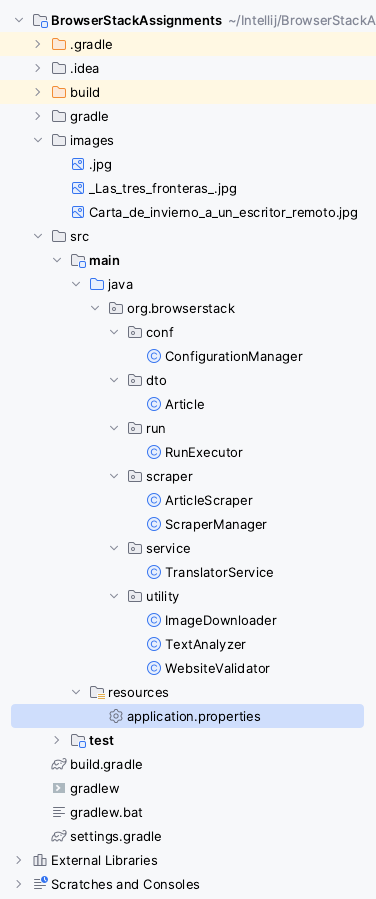
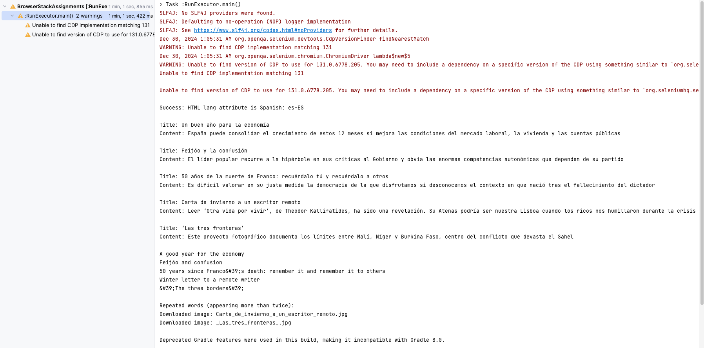

# BrowserStackAssignments
This repository contains the BrowserStack automation assignments implemented using Java and Gradle. The project demonstrates automated browser testing on multiple platforms leveraging the BrowserStack platform.

## Project Structure

- **images/**: Contains image assets used in the project.
- **gradle/**: Gradle wrapper and dependencies.
- **gradlew** / **gradlew.bat**: Platform-specific Gradle wrapper scripts.
- **build.gradle**: Main build file for configuring dependencies and tasks.
- **settings.gradle**: Gradle settings file for multi-project builds.
- **src/**: Source code for the project, including test cases and configurations.
- **build/**: Directory for compiled output and build artifacts.
- **.idea/**: IntelliJ IDEA project settings.

## Requirements

Ensure the following are installed on your system:

- Java 8 or higher
- Gradle 6.x or higher (optional, as the Gradle wrapper is included)
- An IDE like IntelliJ IDEA or Eclipse

## Setup Instructions

1. Clone the repository:
   ```bash
   git clone <repository-url>
   cd BrowserStackAssignments
   ```

## Project Structure Screenshot



## Project Console Output



